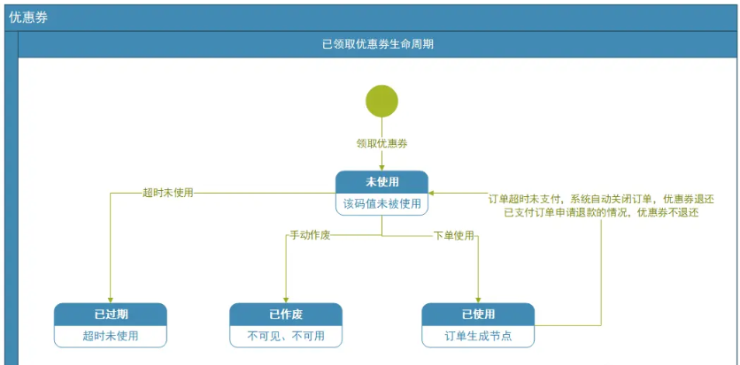

# 优惠卷设计

## 参考网站

[优惠券的设计分享_varyall的博客-CSDN博客](https://blog.csdn.net/varyall/article/details/81485365?spm=1001.2101.3001.6661.1&utm_medium=distribute.pc_relevant_t0.none-task-blog-2%7Edefault%7ECTRLIST%7Edefault-1-81485365-blog-121262813.pc_relevant_multi_platform_whitelistv1_exp3w&depth_1-utm_source=distribute.pc_relevant_t0.none-task-blog-2%7Edefault%7ECTRLIST%7Edefault-1-81485365-blog-121262813.pc_relevant_multi_platform_whitelistv1_exp3w&utm_relevant_index=1)

[订单优惠均摊算法_失策狗的博客-CSDN博客_优惠分摊到各个商品计算方法](https://blog.csdn.net/weixin_43947404/article/details/109034244?spm=1001.2101.3001.6650.5&utm_medium=distribute.pc_relevant.none-task-blog-2%7Edefault%7EBlogCommendFromBaidu%7Edefault-5-109034244-blog-121262813.pc_relevant_multi_platform_whitelistv1_exp3w&depth_1-utm_source=distribute.pc_relevant.none-task-blog-2%7Edefault%7EBlogCommendFromBaidu%7Edefault-5-109034244-blog-121262813.pc_relevant_multi_platform_whitelistv1_exp3w&utm_relevant_index=10)

[优惠券叠加规则、优惠分摊介绍_AP0906424的博客-CSDN博客_优惠券分摊计算方法](https://blog.csdn.net/AP0906424/article/details/121262813)

## 一、传统电商优惠券

- 按照发放的主体分
  
  - 平台券
  
  - 店铺券

- 按照使用功能分
  
  - 新人券：面对新注册的客户，领取后满足条件使用
  
  - 现金券：使用门槛较低，直接抵扣XX 元
  
  - 满减券：满XX 元 减XX 元
  
  - 免单券：使用该券面单
  
  - 积分：使用积分抵扣对应的价格

- 按照使用范围分
  
  - 单品券   指定商品适用
  
  - 品类券   指定品类商品适用
  
  - 品牌券   指定品牌适用
  
  - 全场券   不指定商品

## 二、优惠券设计

### 优惠券活动生命周期

### 已领取优惠券生命周期

### H5前端逻辑

### UI 结算页面

## 三、优惠券叠加规则

不管是平台优惠券、还是店铺优惠券，总来的说优惠叠加顺序为：**优先计算单品级优惠工具、再计算店铺级优惠工具、最后计算跨店优惠。**

单品级优惠：针对于单个商品的打折、减价、促销价等打折方式的优惠级如前N件优惠、聚划算活动价、淘抢购活动价、大促价、日常活动价等。

店铺级优惠：所有针对店铺商品或店铺内部分商品的满减满折优惠适用场景包含但不限于天猫、淘宝、聚划算、淘抢购、飞猪等。包括但不仅限于聚划算满减满折（含下单立减第N件N元等）、优惠券（含有价优惠券、店铺优惠券、商品优惠券）、满折等。

跨店级优惠：支持平台跨店铺使用的优惠，如会员卡、天猫双11购物津贴、天猫品类券、聚划算跨店满减、淘宝跨店满减、飞猪满减券、飞猪旅行红包等。

### 1、介绍店铺优惠券的叠加使用规则

(1) 店铺优惠券和商品优惠券无法叠加使用，一次下单中只能使用一张，系统默认生效优惠力度最大的优惠券。

商品优惠券：简单的理解，就是针对特定宝贝的优惠券，在店家打造爆款的时候，只需要打造一两个爆款，这个时候就可以通过商品优惠券的形式来做活动，所以商品优惠券针对的是部分商品。

店铺优惠券：顾名思义，它是针对店铺的一种优惠券，能够享受到优惠的宝贝是店铺里的所有宝贝，只要能够达到店铺优惠券的使用门槛，店铺里的任意商品都可以使用它。

店铺优惠券和商品优惠券是比较常见的两类优惠券，往往都是商家发放的，这两种区别主要是针对的范围不同，前者范围广，而后者范围小，至于两者是不是可以同时使用，就要看优惠券的使用门槛，不过一般情况下，商家都不会允许两种优惠同时使用的，不然让利就有点过多了。

(2) 店铺优惠券、店铺商品优惠券、店铺优惠活动

店铺活动指由店铺发起的单品促销、满M元减N元、满M元打N折、满M件免N件等等店铺促销类型的活动。

当购买的商品既符合店铺优惠券、也满足店铺优惠活动条件，两者可以叠加使用过，先计算优惠券满减，再计算活动优惠。

### 2、跨店优惠券和店铺优惠券

一般情况下，店铺优惠券适合店铺通用，只要满足优惠券的自身使用条件，就可以和其它折扣活动叠加享受，其中包括跨店满减。

优惠叠加顺序为：优先计算单品级优惠工具、再计算店铺级优惠工具、最后计算跨店优惠。单品级优惠工具(默认生效最低价)、本店铺满减(一笔子订单仅可选择一个店铺级活动)、优惠券(商品优惠券/店铺优惠券/店铺红包(仅集市)，一笔子订单仅支持一张店铺优惠券)、平台跨店满减(购物津贴/品类券/跨店满减)、淘金币、天猫点券卡、红包。(仅供参考)

### 3、平行式门槛计算规则

目前，某宝、某东都是使用的是平行式门槛优惠计算规则，每一层级优惠都直接根据商品的单品优惠价来计算是否符合门槛，只要单品优惠价或单品优惠价总和满足各层级优惠门槛，即可同时享受各可用优惠。(单品级、店铺级、跨店级)

## 四、优惠券分配规则

用户在平台选品下单前后，都会得到各种各样的折扣和优惠，如商家的提供的优惠券、平台的优惠券、红包、积分或者其他的虚拟货币等。

在用户结算时，可以用这些优惠券等虚拟资产抵扣一定的订单金额，订单实付金额公式如下：

订单总金额 = 商品总金额 + 运费 - 总优惠金额

其中：

总优惠券金额 = 促销活动优惠金额 + 优惠券优惠金额 + 虚拟资产(红包或积分)抵扣金额

单个商品优惠后的价格公式，如下：

单个商品优惠后的价格 = 商品价格 - 总优惠金额 * ( 商品金额 / 订单总金额 )

优惠分摊原则，不但应该按比例分摊，还应在满足优惠条件的商品上，按照商品金额的比列分摊，而不是盲分摊。
