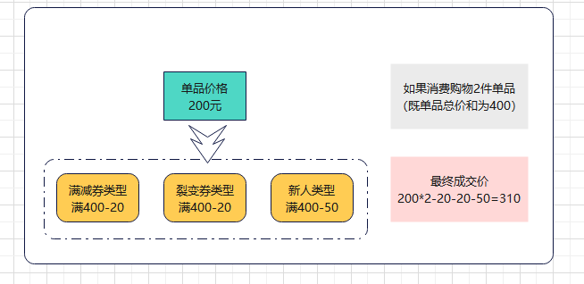
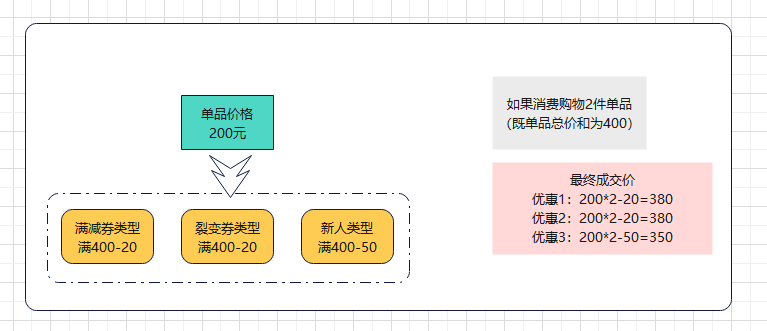
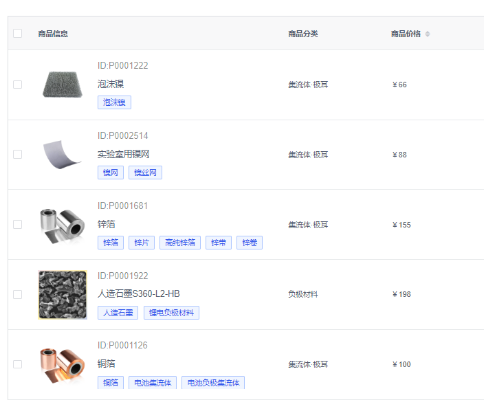
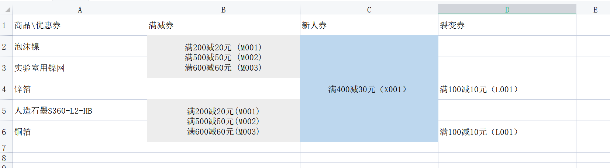
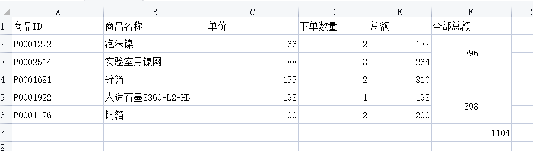
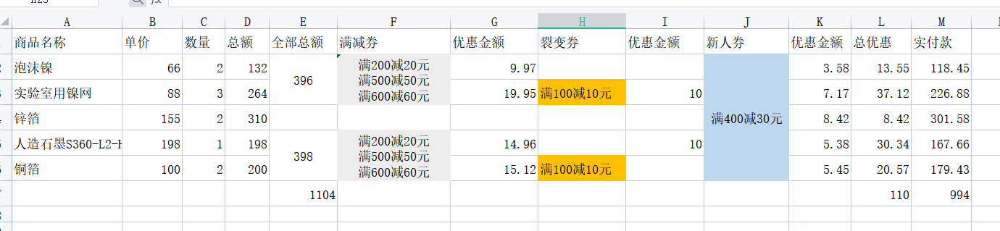
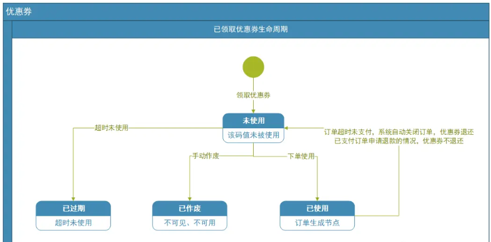

# 开学季活动问题

## 活动叠加

- 限时折扣活动

- 优惠券活动 （使用功能区分）
  
  - 满减券
    
    - 限定商品
    
    - 全品类
  
  - 新人券
    
    - 限定商品
    
    - 全品类
  
  - 裂变券 （好友助力）
    
    - 限定商品
    
    - 全品类

## 券是否叠加

### 1、不同维度的券允许叠加

#### 叠加规则

满减券 ：当前维度下，一个订单只允许使用一张

新人券：当前维度下，一个订单只允许使用一张

裂变券 ：当前维度下，一个订单只允许使用一张

...

不同维度的券允许叠加

总来的说优惠叠加顺序为：**优先计算满减券、再计算裂变券、最后计算新人券**。

(范围越大，权重越小，权重优先级待商榷)

#### 平行式门槛计算规则

        每一层级优惠都直接根据商品的单品价格 来计算是否符合门槛，只要单品价格或单品总价和满足各层级优惠门槛，即可同时享受各可用优惠。(满减券+新人券+裂变券   ),如下图

                                    

### 2、全部券不允许叠加

        根据当前选择的满减券计算，如下图

## 优惠券分配规则

        用户在平台选品下单前后，都会得到各种各样的折扣和优惠，如商家的提供的优惠券、平台的优惠券、红包、积分或者其他的虚拟货币等。

        在用户结算时，可以用这些优惠券等虚拟资产抵扣一定的订单金额，订单实付金额公式如下：

        订单总金额 = 商品总金额 + 运费（0） - 总优惠金额

其中：

总优惠券金额 = 促销活动优惠金额 + 优惠券优惠金额 + 虚拟资产(红包或积分)抵扣金额

单个商品优惠后的价格公式，如下：

单个商品优惠后的价格 = 商品价格 - 总优惠金额 * ( 商品金额 / 订单总金额 )

### 例子说明

**背景说明：**

假设订单中含有下面五件件商品，且均包邮。

1、其中 泡沫镍、实验室用镍网、人造石墨S360-L2-HB、铜箔 均参与满减券类型 （均可使用满200减20元，满500减50元，满600减60元）

2、用户领取 新人券，全部商品可用 

3、用户好友助力领取的裂变券 满100减10元 适用商品  锌箔、铜箔

下单商品

假设情况，用户选择最大优惠

### 结算

##### 允许叠加券

##### 1、计算满减券类型的优惠金额

泡沫镍 + 实验室用镍网+人造石墨S360-L2-HB+铜箔 = 794 满足 满600减60元

 泡沫镍的满减金额 ：  (132/794)*60 = 9.97

实验室用镍网的满减金额 ： (264/794)*60 = 19.95

人造石墨S360-L2-HB 的满减金额：(198/794)*60 = 14.96

铜箔的满减金额：60-(9.97+19.95+14.96)= 15.12

##### 2、计算裂变券类型的优惠金额

锌箔的满减 10

铜箔的满减 10

##### 3、计算新人券类型的优惠金额

新人券适用全部商品

泡沫镍 + 实验室用镍网+人造石墨S360-L2-HB+铜箔+锌箔 = 1104

 泡沫镍的满减金额 ：  (132/1104)*30 = 3.58

实验室用镍网的满减金额 ：  (264/1104)*30 = 7.17

锌箔的满减金额: (310/1104)*30 = 8.42

人造石墨S360-L2-HB 的满减金额: (198/1104)*30 = 5.38

铜箔的满减金额: 30 -(3.58+7.17+8.42+5.38) = 5.44

#### 不允许券叠加

   业务场景1：满600减60元

   优惠价统计

泡沫镍 + 实验室用镍网+人造石墨S360-L2-HB+铜箔 = 794 满足 满600减60元

泡沫镍的满减金额 ： (132/794)*60 = 9.97

实验室用镍网的满减金额 ： (264/794)*60 = 19.95

人造石墨S360-L2-HB 的满减金额：(198/794)*60 = 14.96

铜箔的满减金额：60-(9.97+19.95+14.96)= 15.12

## 叠加券与不叠加券对比

平行式门槛计算规则
优点：向下兼容，后期可拓展（积分抵扣券兑换等）
缺点：极端0元购 ，盈亏由运维控制

不允许叠加券

优点：容易控制成本
缺点：业务单一

## 优惠券生命周期

### 订单取消

订单取消或待支付超时，系统主动取消，券回滚

- 线上支付：取消订单，优惠券（有效期）回滚

- 线下支付：取消订单，优惠券（有效期）回滚

- 线上+线下支付 (拆掉)
  
  - 线上 结算成功 +  线下 取消订单  优惠金额回退问题 ？
  
  - 线下 结算成功 +  线上 取消订单   优惠金额回退问题 ？

## 活动叠加疑问

